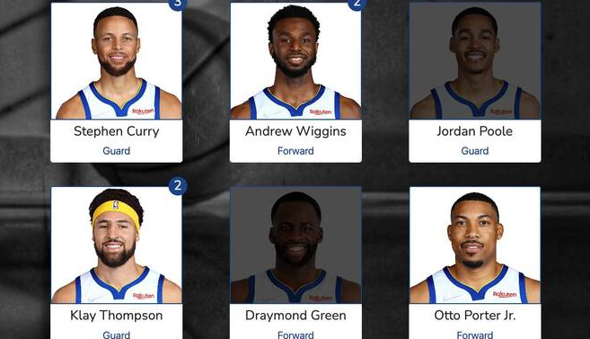

# NBA Digital Album

NBA Digital Album  is the final project created during a 10-week Fullstack Coding Bootcamp. The task was to realize the project within two weeks in a team of four students. In the course of time and after numerous relocations, it can happen that the beloved Panini albums break or get lost. The project came about under the motto "get your albums back". As a user you can have albums from the last three seasons. In order to get stickers with the statistics of the individual players in a team, you have to answer the question correctly in a quiz by selecting from three possible answers.

## Contributors

Sergio García:      https://github.com/Sergio-agile

Luke Bullen:        https://github.com/Luke-Bullen

Florian Cywinski:   https://github.com/Florian-Cywinski

James Carlon:       https://github.com/jcarlon23

### Rails-templates

Rails app generated with [lewagon/rails-templates](https://github.com/lewagon/rails-templates).
